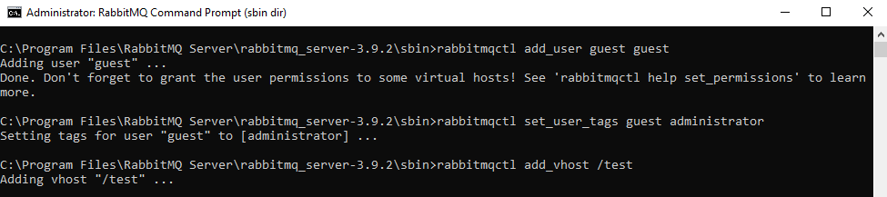
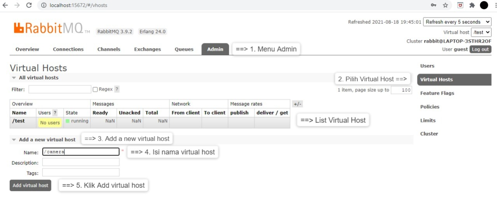
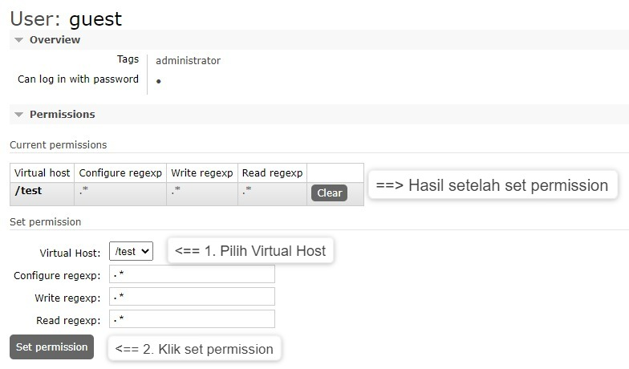
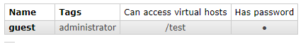

## RabbitMQ
___
### Langkah-Langkah untuk Membuat _User dan Virtual Host_ RabbitMQ :
1. _Download_ RabbitMQ di link berikut ini : https://www.rabbitmq.com/install-windows.html.

    

2. Setelah itu klik rabbitmq-server-3.9.3.exe untuk menginstall, jika muncul gambar _erlang no detect_ (seperti gambar dibawah ini).

    
 
3. Klik _yes_ untuk menuju ke link berikut ini : https://www.erlang.org/downloads. _Download_ dan pilih Erlang sesuai dengan spesifikasi laptop atau PC.

   

4. _Install_ Erlang seperti berikut ini :

    

5. Jika _install_ Erlang berhasil selanjutnya _install_ RabbitMQ seperti berikut ini :

    

6. ___Klik Windows -> Expand_ -> klik _rabbitmq service start___
       
    

7. Masuk ke chrome lalu ketik http://localhost:15672/, GUI Web RabbitMQ tidak akan muncul bagi pemula, maka perlu mengaktifkan RabbitMQ dengan cara : __klik _windows -> Expand_ -> klik _rabbitmq command prompt_ -> ketik _rabbitmq-plugins enable rabbitmq_management -> Enter___.

    

8. Kembali ke chrome untuk mengecek dengan mengetik http://localhost:15672/. Maka akan tampil seperi pada gambar dibawah ini :

    

9. Kembali ke _RabbitMQ command prompt_ untuk membuat _username, password_ dan _virtual host_ dengan cara : 
   - Membuat _username_ dan _password_ : __rabbitmqctl add_user < username > < password > -> Enter__. 
   - Akses _Tags Management_ : __ketik rabbitmqctl set_user_tags < username > < administrator >  -> Enter__.
   - Membuat _Virtual Host_ : __rabbitmqctl add_vhost < nama_vhost >__.  
   
   Maka hasilnya seperti gambar berikut ini :
   
     

10. Kembali ke web rabbitmq lalu _login_ dengan _username_ dan _password_ yang sudah dibuat seperti gambar berikut ini :

    

11. Tampilan awal atau GUI Web Rabbitmq.

    

12. Masuk ke _menu admin_ untuk melihat _users_ yang sudah dibuat. Selain membuat _user_ melalui rabbitmq command prompt, _user_ bisa juga dibuat melalui web rabbitmq dengan cara : __Masuk _menu admin_ -> Pilih _User -> Add a user_ -> Isi _Username_ -> Isi _Password_ -> Isi _Tags_ -> klik _add user___. Untuk lebih jelasnya silahkan lihat gambar berikut ini :

    

13. Cara add virtual host di web rabbitmq yaitu : __Masuk _menu admin_ -> Pilih _virtual host_ -> _add a new virtual host_ -> isi nama _vhost_ -> klik _add virtual host___. Untuk lebih jelasnya silahkan lihat gambar berikut ini :

    

14. Memberikan izin agar _user_ dapat mengakses _virtual host_ dengan cara : __Masuk _menu admin_ -> Pilih _User_ -> pilih nama _user_ yang sudah dibuat -> pilih _vhost_ -> klik _set permission___. Untuk lebih jelasnya silahkan lihat gambar berikut ini :

    

15. Jika sudah mengikuti langkah - langkah diatas maka _Virtual Host_ sudah dapat diakses.

    

